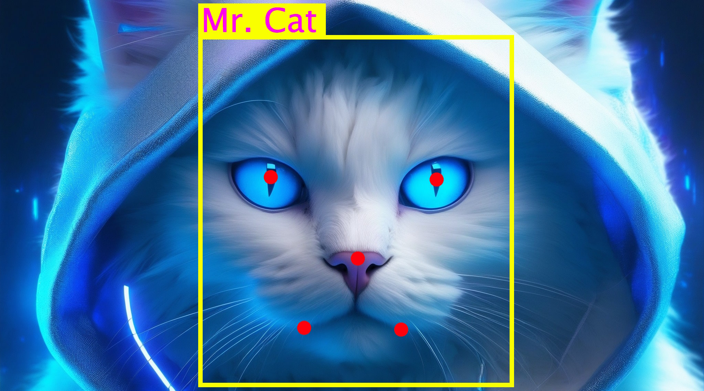

# Auto Annotator
An extendable tool for automatic annotation of image data by a combination of deep neural networks.



The main goal of this annotator is to prioritize the high quality of pedictions rather speed. `auto-annotator` is made to be more precise than most of the tools available for the public. It uses ensembles of deep neural models to ensure the high quality of its predictions.
Neural networks trained on clean datasets produce better results than the ones utilized larger but noisy datasets.

The primary objective of this annotator is to prioritize the accuracy and quality of predictions over speed. The `auto-annotator` has been specifically designed to surpass the precision offered by most publicly available tools. It leverages ensembles of deep neural models to ensure the utmost quality in its predictions. It is important to note that neural networks trained on clean datasets tend to yield superior results compared to those trained on larger but noisier datasets.


## FAQ
### What are the reasons for choosing this data labeling tool over the alternative of employing human annotators?
#### Human accuracy is not so good
Long time ago Andrej Karpathy [observed](http://karpathy.github.io/2011/04/27/manually-classifying-cifar10/) that his accuracy was only 94% when he tried to label just 400 images of the CIFAR-10 dataset while SOTA [Efficient adaptive ensembling for image classification](https://onlinelibrary.wiley.com/doi/10.1111/exsy.13424) (August 29, 2023) achieves >99.6% accuracy.
When expert labelers had to choose from ~100 labels while annotating ImageNet, [their error rate increased to 13-15%](http://karpathy.github.io/2014/09/02/what-i-learned-from-competing-against-a-convnet-on-imagenet/).

Andrej's error rate was determined to be 5.1%, and he initially invested approximately one minute in labeling a single image. Conversely, utilizing [Florence](https://arxiv.org/abs/2111.11432v1) or never models for the same task can deliver a top-5 error rate of less than 1%.

### Why yet another tool?


### It can automate labeling

Usually, labeling is done via humans who, as neural networks, tend to make mistakes. The rate of mistakes increases with a volume of data to be annotated. 


## Supported tasks
- [ ] Face and landmarks detection 
- [ ] Face descriptor extraction
- [ ] Faces clusterization

## 📊 Benchmarks
### Speed
| Task     | Models | Hardware | Time, s |
| ---      | ---    | ---      | ---     |
| Face detection + landmarks | -         |5900x+3090|-|
| Face descriptor extraction | -         |5900x+3090|-|

### Accuracy
TODO

## 🏗 Installation
### PIP package
```bash
pip install auto-annotator
```
🟡 Note: PIP package construction currently in progress
### Docker TODO
```
docker build ...
docker run ...
```

## 🏰 Legacy
Current repository takes ideas and some code form the following projects:
- [faces_detanator](https://github.com/IgorHoholko/faces_detanator)